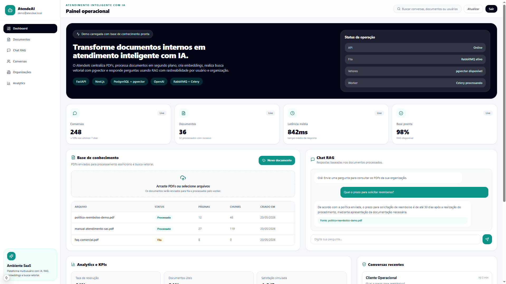

# DocAtende AI


## Sobre o projeto

O **DocAtende AI** é um protótipo de plataforma SaaS de atendimento inteligente com IA, desenvolvido para empresas que precisam transformar documentos internos em uma base de conhecimento consultável.

A plataforma permite centralizar documentos PDF, processar conteúdos em segundo plano, gerar embeddings, realizar busca vetorial e responder perguntas por meio de um chat com RAG.

O objetivo do projeto é simular uma solução SaaS real, com foco em atendimento, automação, documentos corporativos, rastreabilidade e análise operacional.

---

## Preview



---

## Principais funcionalidades

- Chatbot com RAG
- Busca vetorial em documentos PDF
- Ingestão assíncrona de documentos
- Histórico de conversas por usuário e organização
- Painel de analytics e KPIs
- Autenticação JWT
- Arquitetura multiusuário
- Processamento em fila com RabbitMQ e Celery
- API documentada com OpenAPI
- Ambiente conteinerizado com Docker Compose

---

## Stack técnica

### Backend

- FastAPI
- PostgreSQL
- pgvector
- Redis
- RabbitMQ
- Celery
- OpenAI API
- JWT

### Frontend

- Next.js
- TypeScript
- Tailwind CSS
- Lucide React

### Infraestrutura

- Docker
- Docker Compose
- OpenAPI
- Postman

---

## Arquitetura

```text
Usuário
  ↓
Frontend Next.js
  ↓
Backend FastAPI
  ↓
PostgreSQL + pgvector
  ↓
OpenAI Embeddings

Backend FastAPI
  ↓
RabbitMQ
  ↓
Celery Worker
  ↓
Processamento assíncrono de documentos

Backend FastAPI
  ↓
Redis
  ↓
Cache e controle operacional